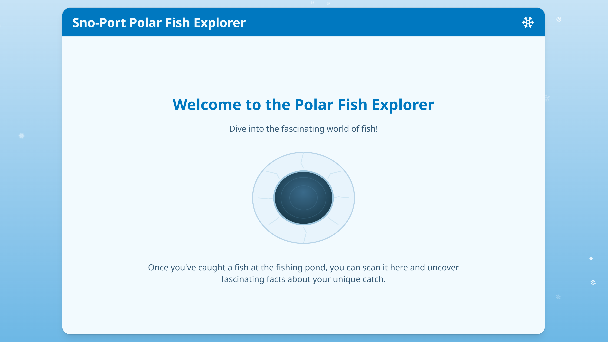
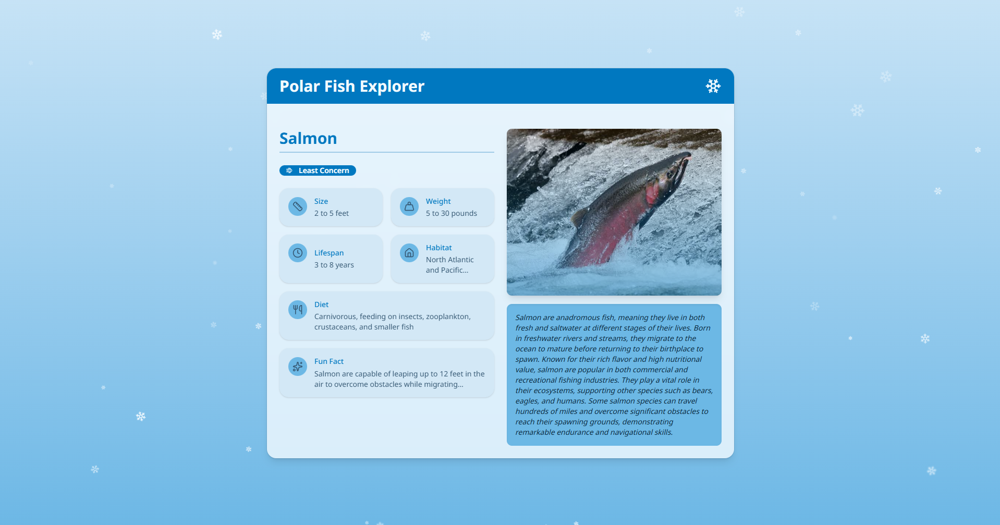

# Polar Ice Fishing Scanner

Interactive exhibit software for the Polar Ice Fishing display at Sno-Port. Visitors "catch" fish and scan them with an NFC reader to learn fun facts about polar marine life.

<p align="center">
  
  
</p>

## Development

```bash
# Install dependencies
npm install

# Run in dev mode (NFC disabled on non-Linux)
npm run tauri:dev

# Build for production (On raspberry pi with the hat)
npm run tauri:build
```

Press `A` in dev mode to simulate scanning a random fish.

## Hardware Setup

The NFC reader connects via SPI on Raspberry Pi:
- Reset: GPIO 20
- NSS/CS: GPIO 4

Fish are identified by NTAG213 tags containing an ID in the format `en<number>`.

## Adding/Editing Fish

Fish data is embedded directly in `src-tauri/src/main.rs` as a static array (`FISH_DATA`). To add or edit fish, modify that array and rebuild, need to also place corresponding image in `./public`
